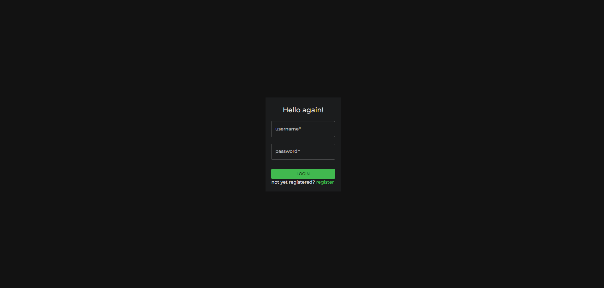
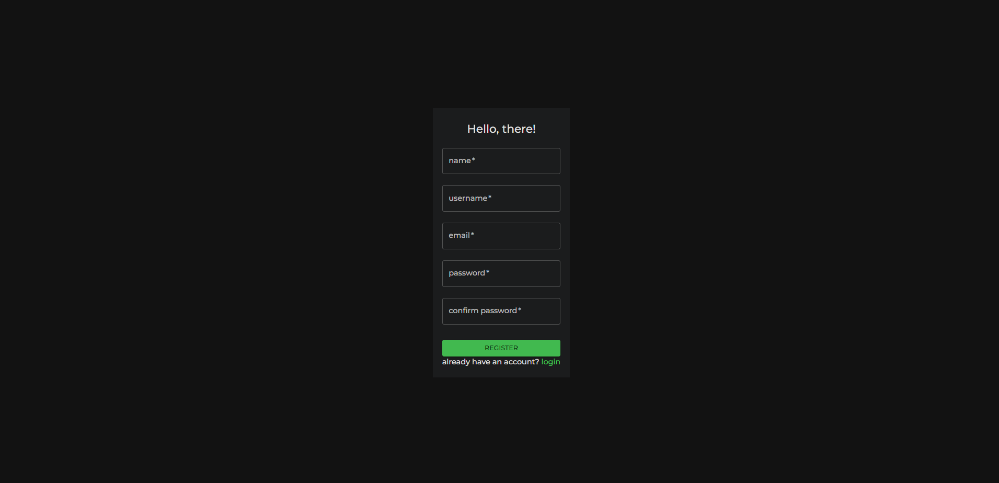
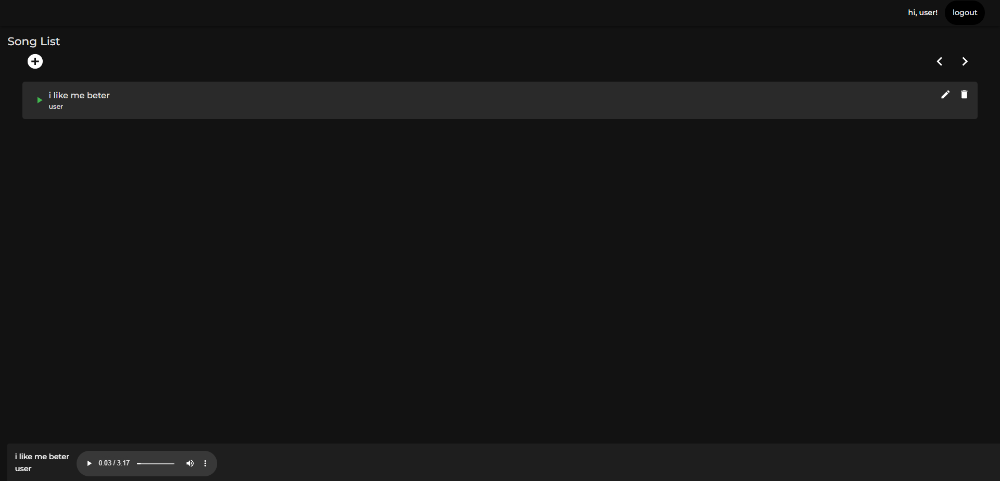
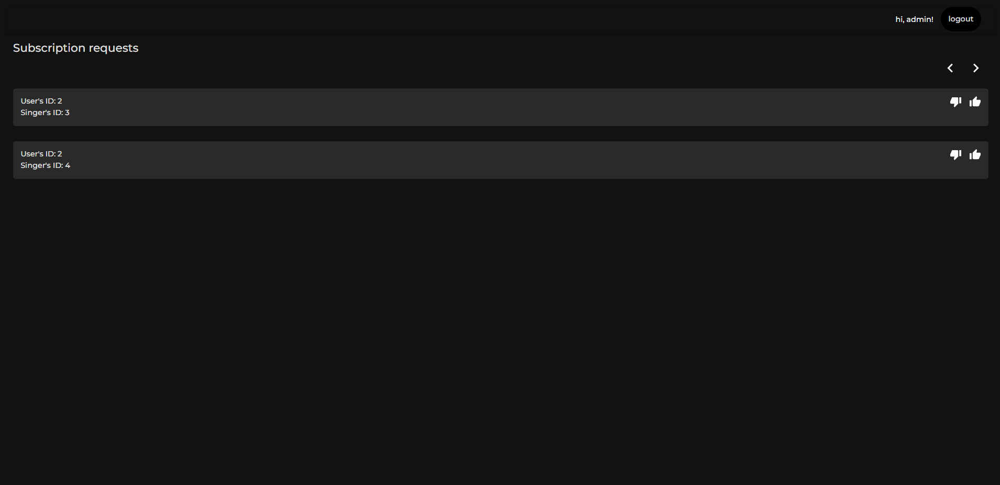
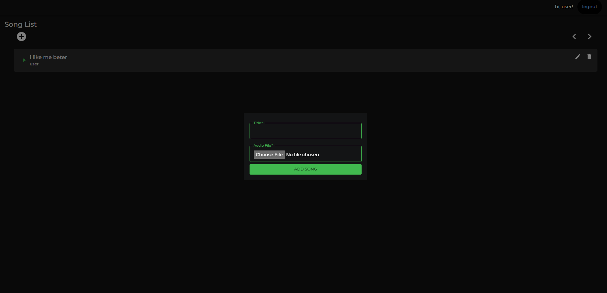
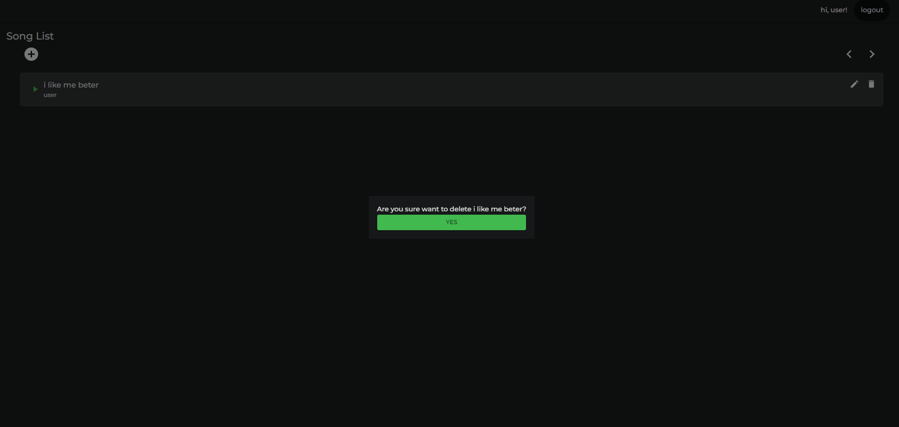
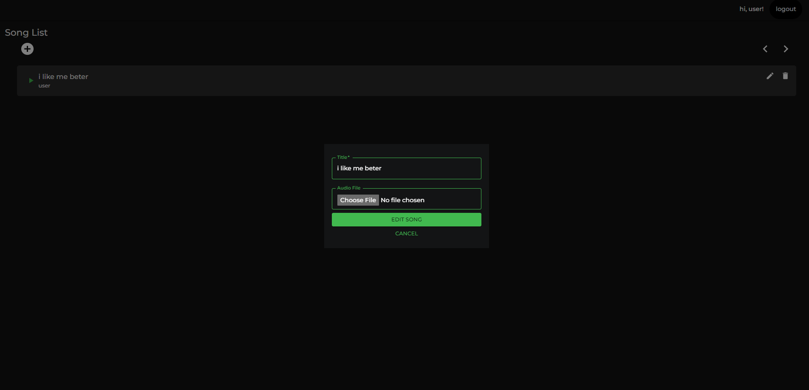

# description

a website for maintaining artists and their songs. specifically for premium artists. this service is subscription based, so there's also and admin who can reject or accept the subscription request

# setup repo and running

go to Binotify-Config repository. the that repo will setup every other repo.

# system

1. use kebab-case for folder and filename. macos is case insensitive, but linux is not. so to cover all os, use kebab-case.
2. name component with path-based-component-naming, relative from src folder
3. do not use the name `index` for component. use the name of the component instead. index used for folder API
4. rule of thumb, only create folder if it contains more than one file
5. whatever inside screens folder is dumb. it doesn't have any logic in it

remember that this is relatively experimental. So far even I am still not that comfortable with this structure, even though I am the one who structure it this way. but let's see how it goes, we might get something good out of it.

# screenshots

<!-- songlist -->

<!-- subscriptionreq -->

<!-- addmodal -->

<!-- deletemodal -->

<!-- updatemodal -->

# work distribution

| task                                                         | NIM      |
| ------------------------------------------------------------ | -------- |
| structuring based on figma                                   | 13520055 |
| styling                                                      | 13520045 |
| Page subscription request                                    | 13520156 |
| handle case kalau habis update dan hapus song yg lagi diplay | 13520045 |
| Headerbar                                                    | 13520055 |
| Page song list + 3 modal                                     | 13520045 |
| bugfix: fix docker hot reload                                | 13520055 |
| Page login + register with token handling                    | 13520055 |

# file folder structure and component naming reference

[first](https://hackernoon.com/structuring-projects-and-naming-components-in-react-1261b6e18d76)
[second](https://medium.com/@dan_abramov/smart-and-dumb-components-7ca2f9a7c7d0)
[third](https://profy.dev/article/react-folder-structure)
